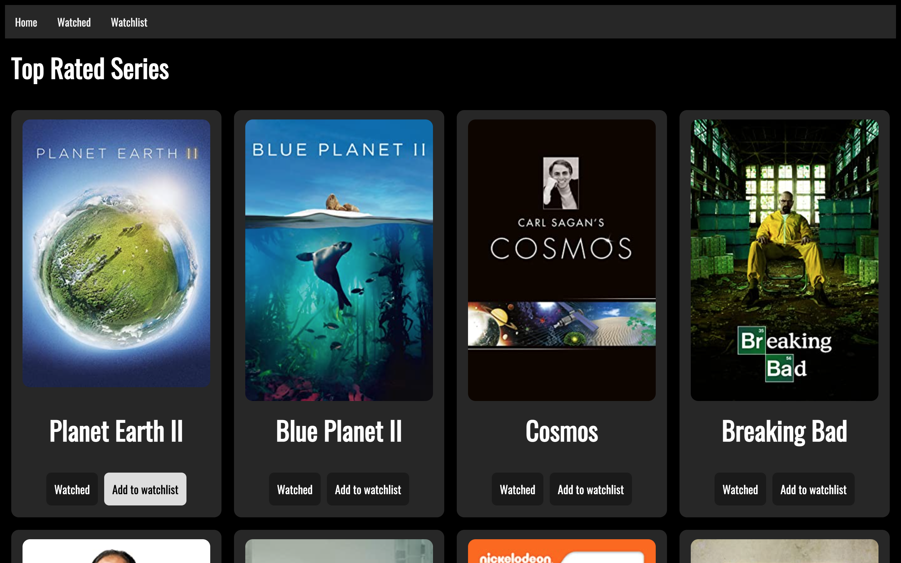
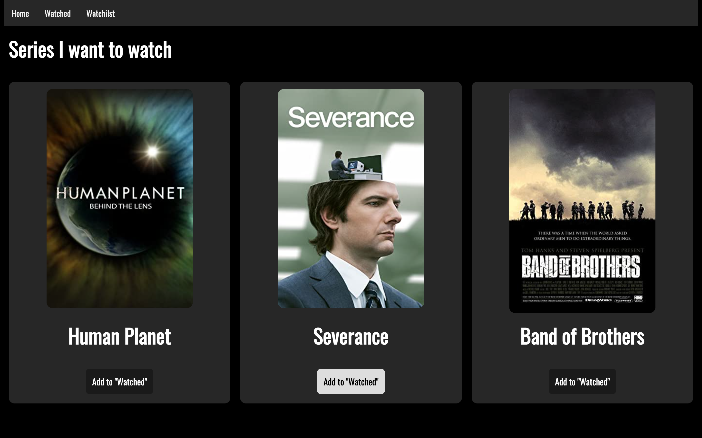

Rakenduse nimi: "My Series"
Autor: Kristel Kolkanen
Rakenduse funktsionaalsuse kirjeldus:
Avaleht
- näitab IMDB lehelt kõige kõrgemalt hinnatud 250 seriaali nime ja postrit
- iga seriaali all on kaks nuppu "Watched" ja "Add to watchlist", mille abil saab seriaale lisada kas vaadatud seriaalide lehele või watchlisti lehele, salvestades need localstorage sisse
Watched
- näitab kõiki seriaale, mis on avalehelt "watched" seriaalide alla valitud
- iga seriaali all on nupud "Rank" ja "Remove", mille abil on võimalik seriaali 1-5ni hinnata ja vaadatud seriaalide hulgast eemaldada.
(Ranking süsteemi ei saanud lõpuni tööle. Antud hinnangud salvestuvad küll localstorage sisse, kuid ei jää lehel nähtavaks. Samuti oli idee kuvada seriaale sorteeritult ehk kõrgema hinnanguga seriaalid ees ja madalamaga taga)
"Watchlist"
- näitab kõiki seriaale, mis on avalehelt "add to watchlist" seriaalide alla valitud
- iga seriaali all on nupp "add to watched", mis eemaldab seriaali watchlistist ja lisab vaadatud seriaalide listi

